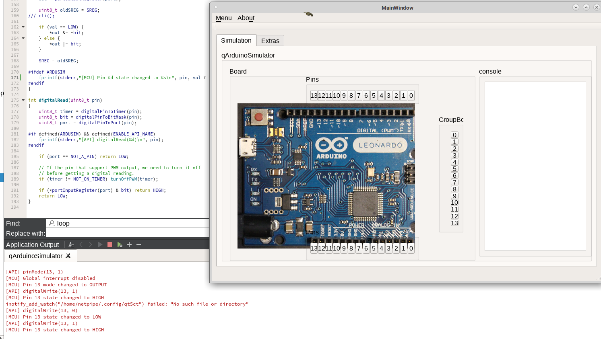

# qArduinoSimulator

Arduino Simulator v0.1

# Build

1. $ mkdir build && cp *.png build && cd build
2. $ qmake .. && make

other option is to use the makefile.

irrlicht version working already here https://github.com/tecan/IrrlichtDemos/tree/master/Apps/ArduinoSim
